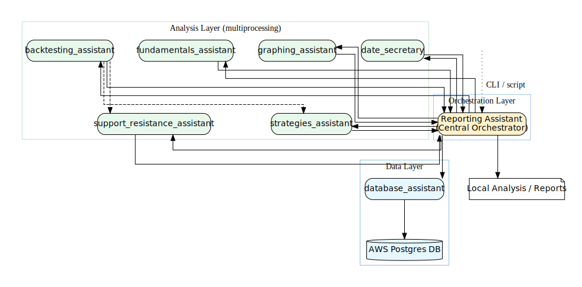

# Market Assistants

MarketAssistants is an organization of modular Python packages for financial data analysis, screening, and reporting. It enables technical and fundamental analysis, backtesting, and reporting, with the ability to push results to AWS Postgres DB or perform local analysis.

## Assistants
- [reporting_assistant](https://github.com/MarketAssistants/reporting_assistant): Central orchestrator for analysis and reporting
- [database_assistant](https://github.com/MarketAssistants/database-assistant): Database operations and technical metrics
- [fundamentals_assistant](https://github.com/MarketAssistants/fundamentals-assistant): Fundamental data analysis
- [graphing_assistant](https://github.com/MarketAssistants/graphing_assistant): Visualization and analysis
- [backtesting_assistant](https://github.com/MarketAssistants/backtesting_assistant): Backtesting strategies
- [strategies_assistant](https://github.com/MarketAssistants/strategies_assistant): Strategy analysis utilities
- [support_resistance_assistant](https://github.com/MarketAssistants/support-resistance-assistant): Support/resistance analysis
- [date_secretary](https://github.com/MarketAssistants/date-secretary): Date management and utilities


## Architecture



- **Object-Oriented Design:** Each assistant (database, reporting, fundamentals, graphing, strategies, support/resistance, date secretary, backtesting) is a Python package with a main class and supporting modules.
- **Interactions:** Assistants interact via shared payloads and multiprocessing. Reporting Assistant orchestrates analysis by calling other assistants. Database Assistant manages data storage and updates, including technical metrics. Fundamental and Graphing Assistants provide deeper analysis and visualization.

## Parallel Program Architecture

This project is designed as a parallel program, leveraging Python's multiprocessing to efficiently analyze and report on financial data. The `reporting_assistant` acts as the central orchestrator, spawning and managing multiple processes to run analyses in parallel across different assistants.

### How Reporting Assistant Instantiates and Uses Other Assistants
- The `reporting_assistant` dynamically imports and instantiates other assistants (such as `database_assistant`, `fundamentals_assistant`, `graphing_assistant`, `strategies_assistant`, `support_resistance_assistant`, `date_secretary`, `backtesting_assistant`, etc.) as needed for each analysis or report.
- For each analysis task, the reporting assistant prepares a **payload** (a dictionary containing all relevant data, such as tickers, dates, price/volume arrays, and configuration parameters).
- This payload is passed to the target assistant's main method (usually `run_reports` or similar), which processes the data and returns results.
- The reporting assistant collects results from all assistants, aggregates them, and can push them to the database or generate reports.
- The assistants themselves may also instantiate and call each other for specialized tasks (e.g., `backtesting_assistant` may use `strategies_assistant` and `support_resistance_assistant`).

### Example Data Flow
1. **User calls reporting_assistant** (via CLI or script).
2. **Reporting assistant prepares payloads** for each analysis (e.g., tickers, dates, market cap, etc.).
3. **Reporting assistant spawns processes** and instantiates assistants, passing payloads to their main methods.
4. **Assistants process data in parallel**, returning results.
5. **Reporting assistant aggregates results** and outputs reports or updates the database.

This parallel, modular architecture enables scalable, efficient financial analysis and reporting.

## Setup
1. Download `nasdaq_screener.csv` from [Nasdaq Screener](https://www.nasdaq.com/market-activity/stocks/screener) and place it in the `DATABASE` folder.
2. Install requirements in a virtual environment:
   ```bash
   python3 -m venv venv
   source venv/bin/activate
   pip install -r .github/profile/requirements.txt
   ```

## Running Reporting Assistant
```bash
cd reporting_assistant
python3 -m reporting_assistant list
python3 -m reporting_assistant run <script_name>
```

## Use Cases
- Push technical data to AWS Postgres DB
- Local analysis and screening of stocks, indices, and industries w/ visualizations
- Backtesting strategies and generating reports
